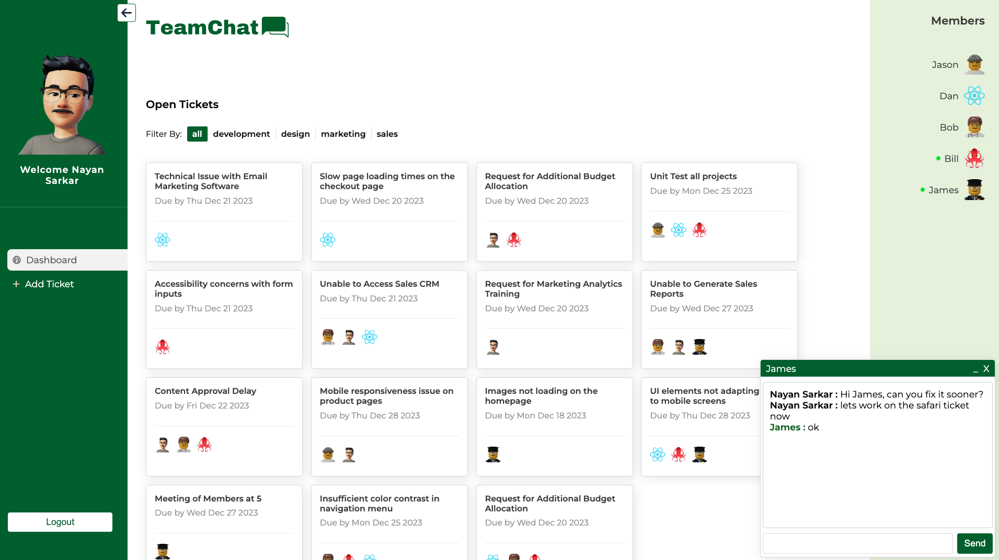
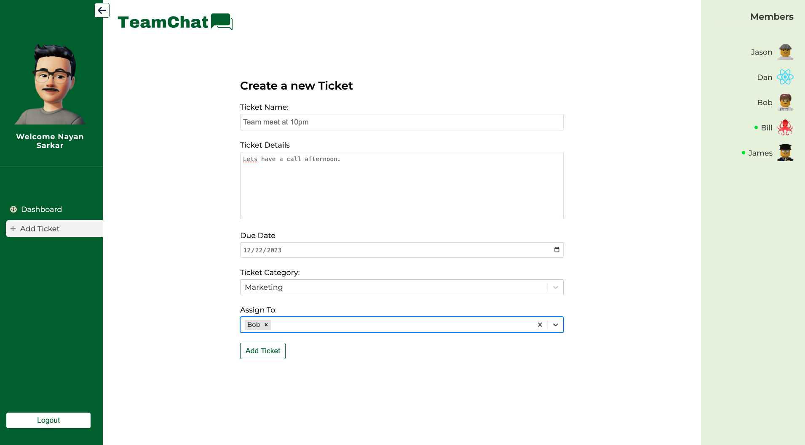
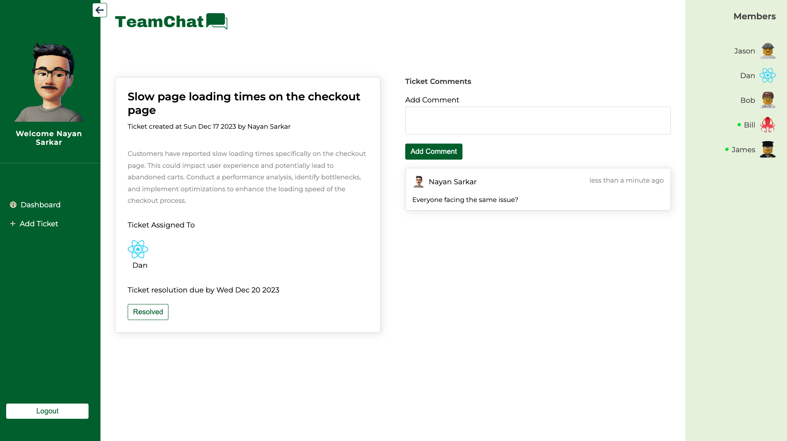

# TeamChat | Collaboration Dashboard | Realtime Messaging | React | React Router 6 | Firebase | NoSQL

A project collaboration tool designed for team members to track, assigns tasks and interact in realtime.

<b>Demo:</b> https://www.youtube.com/watch?v=cChKLAV4ZJM

<b>Live Site</b> https://teamchat-db052.web.app

<b>

## Built With
   

## Features
- Built with React 18 , React Router 6 and Firebase
- Users can chat and message team members in realtime powered by firestore DB
- Performed conditional rendering of components with state passed through ContextAPI
- Route Guarding implemented with protected Routes using React Router 6
- Authentication and Storage Operations handled with Custom React Hooks
- Provided data upload functionality which uploads images firebase storage

## Screenshots

